# NexusEdu Database — Entity Relationship Diagram

Source of truth: [`schema.prisma`](./schema.prisma) (PostgreSQL, managed by Prisma).
Every entity's `id` is a **UUID** (`@default(uuid())`); the **unique student
identifier is `User.id`** — every table that belongs to a student links back
to it via a `userId` foreign key with `onDelete: Cascade`.

```mermaid
erDiagram
    User ||--o{ DeviceSession : "owns sessions"
    User ||--o{ LoginLog : "has logins"
    User ||--o{ ActivityLog : "has activities"
    User ||--o{ Course : "teaches"
    User ||--o{ TeacherNote : "authors"
    User ||--o{ StudentNote : "writes"
    User ||--o{ ParentLink : "is parent of"
    User ||--o{ ParentLink : "is child of"
    User ||--o{ Enrollment : "enrolls in"
    User ||--o{ ClassTaskSubmission : "submits"
    User ||--o{ Notification : "receives"
    User ||--o{ AttendanceSession : "opens"
    User ||--o{ AttendanceRecord : "marked in"
    User ||--o{ Submission : "hands in"
    User ||--o{ AiUsageLog : "consumes tokens"
    User ||--o{ AiDailyQuota : "daily counter"
    User ||--o{ AiTokenBucket : "token bucket"
    User ||--o{ PasswordResetToken : "reset tokens"
    User ||--o{ KnowledgeChunk : "owns chunks"

    Course ||--o{ Module : "contains"
    Module ||--o{ Lesson : "contains"
    Module ||--o{ Assignment : "contains"
    Assignment ||--o{ Submission : "receives"

    Discussion ||--o{ Reply : "threads"
    User ||--o{ Discussion : "posts"
    User ||--o{ Reply : "replies"

    Section ||--o{ Enrollment : "rosters"
    Section ||--o{ ClassTask : "has classwork"
    Section ||--o{ AttendanceSession : "holds sessions"
    ClassTask ||--o{ ClassTaskSubmission : "gets marked"

    AttendanceSession ||--o{ AttendanceRecord : "captures marks"

    User {
        string id PK "UUID — unique student/teacher/parent id"
        string email UK
        string role "student | teacher | parent | admin"
        int xp
        int streak
        string gradeLevel
        string schoolBoard
        string[] weakSubjects
        string[] strongSubjects
    }
    StudentNote {
        string id PK
        string userId FK "Owner (cascade delete)"
        string title
        string content
        datetime createdAt
        datetime updatedAt
    }
    ActivityLog {
        string id PK
        string userId FK
        string action "e.g. QUIZ_COMPLETED, SHORT_COMPLETED"
        json metadata
    }
    TeacherNote {
        string id PK
        string teacherId FK
        string gradeLevel
        string subject
        string topic
        boolean isPublished
    }
    ParentLink {
        string id PK
        string parentId FK
        string studentId FK
        string status "pending | approved | rejected"
    }
    Enrollment {
        string id PK
        string sectionId FK
        string studentId FK
        string rollNumber
    }
    ClassTaskSubmission {
        string id PK
        string taskId FK
        string studentId FK
        string status "pending | done"
    }
    AttendanceRecord {
        string id PK
        string sessionId FK
        string studentId FK
        string status "present | absent | late | leave"
        string idempotencyKey UK "double-tap guard"
    }
    KnowledgeChunk {
        string id PK
        string userId FK "null = shared content"
        string sourceType "teacher_note | course_lesson | discussion"
        string sourceId
        vector embedding "pgvector, 2048d"
    }
```

## Key constraints worth knowing

| Invariant | Enforced by |
|---|---|
| One mark per student per attendance session | `@@unique([sessionId, studentId])` on `AttendanceRecord` |
| One enrollment per student per section | `@@unique([sectionId, studentId])` on `Enrollment` |
| One parent link per (parent, student) pair | `@@unique([parentId, studentId])` on `ParentLink` |
| One submission per student per class task | `@@unique([taskId, studentId])` on `ClassTaskSubmission` |
| One daily quota row per user per day | `@@unique([userId, date])` on `AiDailyQuota` |
| One token bucket row per user | `AiTokenBucket.userId` is the primary key |
| Email uniqueness | `@unique` on `User.email` |
| Student-owned rows die with the account | `onDelete: Cascade` on every `userId` FK |

## Data flow (app → server)

- **Notes**: app saves locally first (instant UI), then `POST /api/notes` /
  `PUT /api/notes/:id` / `DELETE /api/notes/:id` sync in the background.
  On login the app pulls `GET /api/notes` and merges (server wins by id;
  local notes without an id are uploaded; guest demo notes are dropped).
- **Progress**: local gamification (XP, streak) pushes to `PUT /api/users/progress`
  on login so the leaderboard shows real numbers.
- **Activity**: `POST /api/users/activity` appends to `ActivityLog`
  (quiz completed, short watched) — the raw material for future parent reports.
- **Learner profile**: onboarding choices (class/board/subjects) push to
  `PUT /api/users/profile` on login.
